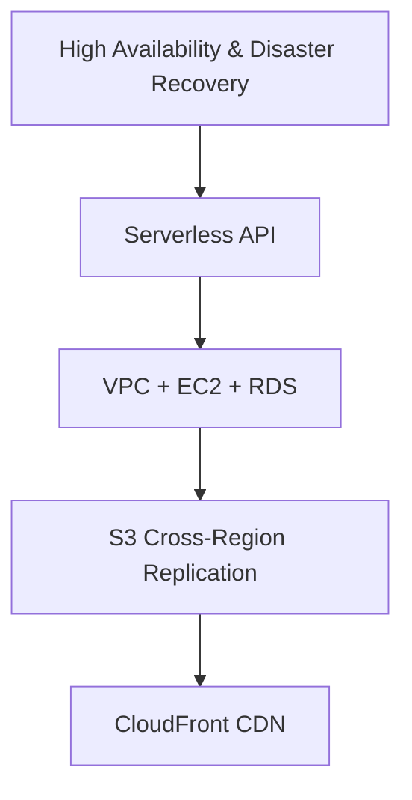

# 🚀 Road to AWS SAA
Questo repository documenta il mio percorso verso la certificazione **AWS Solutions Architect – Associate (SAA)**.  
Ho selezionato 5 laboratori chiave per approfondire concetti fondamentali di AWS: high availability, serverless, networking e gestione dei dati.

---

## 🖼️ Diagramma generale

---

## 🛠️ Laboratori principali

### 1️⃣ High Availability & Disaster Recovery 
**Badge:** `High Availability` | `Disaster Recovery` | `Networking`  
- Configurazione **Multi-AZ** e failover DNS con Route 53  
- Test di **Cross-Region Replication** su S3  
- [Vai al laboratorio](./lab1-high-availability/README.md)

---

### 2️⃣ Serverless API 
**Badge:** `Serverless` | `Lambda` | `API Gateway` | `DynamoDB`  
- Creazione di un'**API serverless**  
- Include esempi di deploy e codice funzionante  
- [Vai al laboratorio](./lab2-serverless-api/README.md)

---

### 3️⃣ VPC + EC2 + RDS 
**Badge:** `Networking` | `Compute` | `Database`  
- Progettazione di un'infrastruttura sicura e scalabile  
- Include script di deploy  
- [Vai al laboratorio](./lab3-vpc-ec2-rds/README.md)

---

### 4️⃣ S3 Cross-Region Replication 
**Badge:** `Storage` | `High Availability` | `Disaster Recovery`  
- Replicazione dei dati tra regioni per garantire alta disponibilità  
- Include note pratiche e configurazioni  
- [Vai al laboratorio](./lab4-s3-cross-region/README.md)

---

### 5️⃣ CloudFront CDN 
**Badge:** `CDN` | `Static Content` | `Caching`  
- Distribuzione globale di contenuti statici  
- Gestione di caching e permessi  
- [Vai al laboratorio](./lab5-cloudfront-cdn/README.md)

---

## 📝 Note generali
- Ogni laboratorio contiene:
  - Descrizione dettagliata
  - Script o template di deploy
  - Note personali e spunti pratici
- Questo repository serve come **documentazione del mio apprendimento pratico AWS** e come **riferimento per l'esame SAA**.

---

## ⚡ Obiettivo
Consolidare le competenze pratiche su AWS, documentare i laboratori più rilevanti e prepararsi efficacemente all'esame **AWS SAA**.
