# 🚀 Road to AWS SAA

Questo repository documenta il mio percorso verso la certificazione **AWS Solutions Architect – Associate (SAA)**. Ho selezionato 5 laboratori chiave per approfondire concetti fondamentali di AWS: high availability, serverless, networking e gestione dei dati.

## 🖼️ Diagramma generale

```mermaid
flowchart TD
    A["Lab 1: High Availability & Disaster Recovery"]
    B["Lab 2: Serverless API"]
    C["Lab 3: VPC + EC2 + RDS"]
    D["Lab 4: S3 Cross-Region Replication"]
    E["Lab 5: CloudFront CDN"]

    A --> B
    B --> C
    C --> D
    D --> E

    style A fill:#2c3e50,stroke:#fff,stroke-width:2px
    style B fill:#34495e,stroke:#fff,stroke-width:2px
    style C fill:#2c3e50,stroke:#fff,stroke-width:2px
    style D fill:#34495e,stroke:#fff,stroke-width:2px
    style E fill:#2c3e50,stroke:#fff,stroke-width:2px
```

## 🛠️ Laboratori principali

### 1️⃣ High Availability & Disaster Recovery 
**Badge:** `High Availability` | `Disaster Recovery` | `Networking`  
- Configurazione **Multi-AZ** e failover DNS con Route 53  
- Test di **Cross-Region Replication** su S3  
- [Vai al laboratorio](./lab1-high-availability/README.md)

---

### 2️⃣ Serverless API 
**Badge:** `Serverless` | `Lambda` | `API Gateway` | `DynamoDB`  
- Creazione di un'**API serverless**  
- Include esempi di deploy e codice funzionante  
- [Vai al laboratorio](./lab2-serverless-api/README.md)

---

### 3️⃣ VPC + EC2 + RDS 
**Badge:** `Networking` | `Compute` | `Database`  
- Progettazione di un'infrastruttura sicura e scalabile  
- Include script di deploy  
- [Vai al laboratorio](./lab3-vpc-ec2-rds/README.md)

---

### 4️⃣ S3 Cross-Region Replication 
**Badge:** `Storage` | `High Availability` | `Disaster Recovery`  
- Replicazione dei dati tra regioni per garantire alta disponibilità  
- Include note pratiche e configurazioni  
- [Vai al laboratorio](./lab4-s3-cross-region/README.md)

---

### 5️⃣ CloudFront CDN 
**Badge:** `CDN` | `Static Content` | `Caching`  
- Distribuzione globale di contenuti statici  
- Gestione di caching e permessi  
- [Vai al laboratorio](./lab5-cloudfront-cdn/README.md)

---

## 📚 Risorse di studio aggiuntive

### Concetti chiave per l'esame SAA:
- **Compute**: EC2, Lambda, ECS, EKS, Auto Scaling
- **Storage**: S3, EBS, EFS, FSx, Storage Gateway
- **Database**: RDS, DynamoDB, ElastiCache, Redshift
- **Networking**: VPC, Route 53, CloudFront, ELB, Direct Connect
- **Security**: IAM, Cognito, KMS, Secrets Manager, GuardDuty
- **Monitoring**: CloudWatch, CloudTrail, X-Ray

### Suggerimenti per l'esame:
- Focalizzati sui **trade-offs** tra soluzioni (costo vs performance vs availability)
- Comprendi bene i **Well-Architected Framework** pillars
- Pratica con domande sui **disaster recovery patterns** (RPO/RTO)
- Studia i **pricing models** dei servizi principali

---

## 📝 Note generali
- Ogni laboratorio contiene:
  - Descrizione dettagliata
  - Script o template di deploy
  - Note personali e spunti pratici
- Questo repository serve come **documentazione del mio apprendimento pratico AWS** e come **riferimento per l'esame SAA**.

---

## ⚡ Obiettivo
Consolidare le competenze pratiche su AWS, documentare i laboratori più rilevanti e prepararsi efficacemente all'esame **AWS SAA**.
