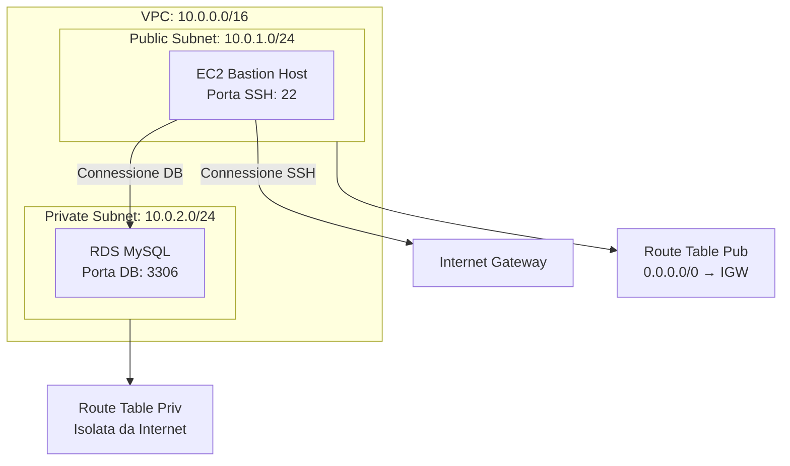

# 🧪 Lab 3: VPC + EC2 + RDS

## 🎯 Obiettivo
Progettare un'infrastruttura **sicura** e **scalabile** su AWS.

---

## 🖼️ Diagramma Architettura

---

## 📋 Passaggi Principali

1. 🗄️ **Creare VPC** con subnet pubbliche e private
2. 💻 **Lanciare EC2** Bastion Host nella subnet pubblica  
3. 🗄️ **Configurare RDS MySQL** nella subnet privata
4. 🔐 **Setup Security Groups** e Network ACLs
5. 🌐 **Configurare routing** e Internet Gateway

---

## 🔒 Security Highlights

- ✅ **Bastion Host Pattern**: Accesso sicuro alle risorse private
- ✅ **Database Isolation**: RDS completamente isolato da Internet
- ✅ **Security Groups**: Controllo traffico a livello istanza
- ✅ **Principle of Least Privilege**: Permessi minimi necessari

---

## 📝 Note Chiave

- **VPC CIDR**: `10.0.0.0/16` per 65,536 indirizzi disponibili
- **Multi-AZ Setup**: Subnet in AZ diverse per high availability  
- **Cost Optimization**: Utilizzo di t3.micro per testing
- **Monitoring**: CloudWatch per metriche e VPC Flow Logs

---

## 📌 Learning Focus

*Questo laboratorio consolida i concetti di **networking**, **sicurezza** e **database management** fondamentali per l'esame AWS Solutions Architect Associate.*
