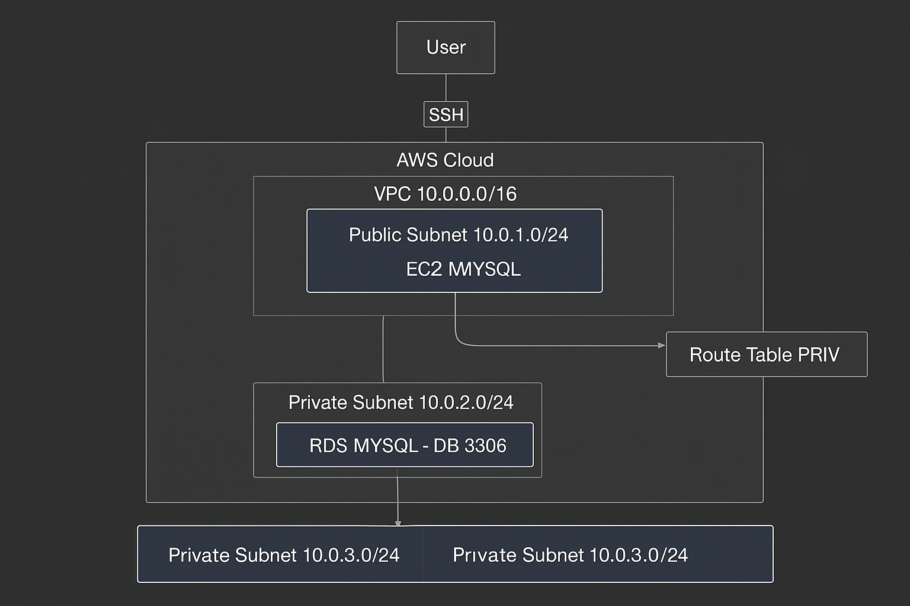

# 🧪 Lab 3: VPC + EC2 + RDS

## 🎯 Obiettivo
Progettare un'infrastruttura **sicura** e **scalabile** su AWS.

---

## 📋 Passaggi Principali

1. 🗄️ **Creare VPC** con subnet pubbliche e private  
2. 💻 **Lanciare EC2** Bastion Host nella subnet pubblica  
3. 🗄️ **Configurare RDS MySQL** nella subnet privata  
4. 🔐 **Setup Security Groups** e Network ACLs  
5. 🌐 **Configurare routing** e Internet Gateway  

---

## 📁 Struttura della cartella

| File / Cartella | Descrizione | Link |
|-----------------|------------|------|
| `backend.tf`    | Configurazione backend remoto (S3 + DynamoDB per lo stato) | [backend.tf](./backend.tf) |
| `variables.tf`  | Definizione delle variabili Terraform | [variables.tf](./variables.tf) |
| `terraform.tfvars` | Valori delle variabili principali | [terraform.tfvars](./terraform.tfvars) |
| `vpc.tf`        | Configurazione della VPC, subnet e route table | [vpc.tf](./vpc.tf) |
| `security.tf`   | Security Groups e regole di accesso | [security.tf](./security.tf) |
| `ec2.tf`        | Bastion Host EC2 e configurazioni associate | [ec2.tf](./ec2.tf) |
| `rds.tf`        | Database RDS MySQL | [rds.tf](./rds.tf) |
| `outputs.tf`    | Outputs principali dell’infrastruttura | [outputs.tf](./outputs.tf) |
| `Makefile`      | Comandi rapidi per Terraform (`init`, `plan`, `apply`, `destroy`) | [Makefile](./Makefile) |
| `scripts/connect_bastion.sh` | Connessione SSH al Bastion Host | [connect_bastion.sh](./scripts/connect_bastion.sh) |
| `scripts/connect_rds.sh` | Connessione al DB tramite Bastion | [connect_rds.sh](./scripts/connect_rds.sh) |
| `scripts/test_infra.sh` | Test rapido infrastruttura EC2 + RDS | [test_infra.sh](./scripts/test_infra.sh) |
| `config/security-group.json` | Configurazione JSON Security Group | [config/security-group.json](./config/security-group.json) |
| `config/db-subnet-group.json` | Configurazione JSON DB Subnet Group | [config/db-subnet-group.json](./config/db-subnet-group.json) |
| `screenshots/`  | Screenshot dei passaggi e configurazioni | [screenshots](./screenshots/) |

---

## 🔒 Security Highlights

- ✅ **Bastion Host Pattern**: Accesso sicuro alle risorse private  
- ✅ **Database Isolation**: RDS completamente isolato da Internet  
- ✅ **Security Groups**: Controllo traffico a livello istanza  
- ✅ **Principle of Least Privilege**: Permessi minimi necessari  

---

## 📝 Note Chiave

- **VPC CIDR**: `10.0.0.0/16` per 65,536 indirizzi disponibili  
- **Multi-AZ Setup**: Subnet in AZ diverse per high availability  
- **Cost Optimization**: Utilizzo di t3.micro per testing  
- **Monitoring**: CloudWatch per metriche e VPC Flow Logs  

---

## 📌 Learning Focus

*Questo laboratorio consolida i concetti di **networking**, **sicurezza** e **database management** fondamentali per l'esame AWS Solutions Architect Associate.*

---

## 🖼️ Diagramma

