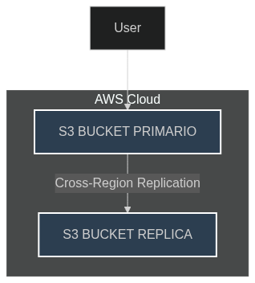

# 🧪 Lab 4: S3 Cross-Region Replication

## 🎯 Obiettivo
Garantire disaster recovery replicando i dati tra più regioni AWS.

---

## 🖼️ Diagramma

---

## 🛠️ Passaggi principali

1. 📦 **Creare bucket S3 primario e secondario**  
2. 🔄 **Configurare Cross-Region Replication (CRR)**  
3. 🧪 **Testare la replicazione** con upload di file  

---

## 📝 Note personali

- ✅ La gestione corretta dei permessi IAM 🔑 è cruciale per la replicazione  

---

## 📌 Learning Focus

*Questo laboratorio evidenzia l’importanza della ridondanza geografica per la continuità operativa.*

---
