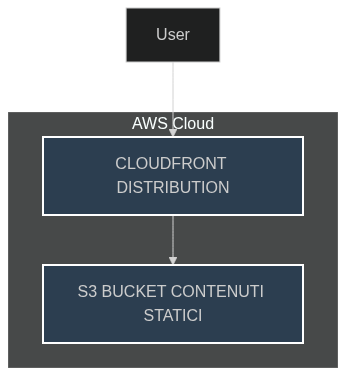

# 🧪 Lab 5: CloudFront CDN

## 🎯 Obiettivo
Distribuire contenuti statici a livello globale con caching e gestione dei permessi.

---

## 🖼️ Diagramma

---

## 🛠️ Passaggi principali

1. 📦 **Creare bucket S3** con contenuti statici  
2. 🚀 **Configurare distribuzione CloudFront**  
3. ♻️ **Gestire caching e invalidation**  
4. 🌐 **Testare accesso globale**  

---

## 📝 Note personali

- ✅ Comprendere TTL e meccanismi di caching di CloudFront è essenziale per garantire performance elevate ⚡  

---

## 📌 Learning Focus

*Questo laboratorio dimostra come ottimizzare la distribuzione di contenuti statici con AWS.*

---
